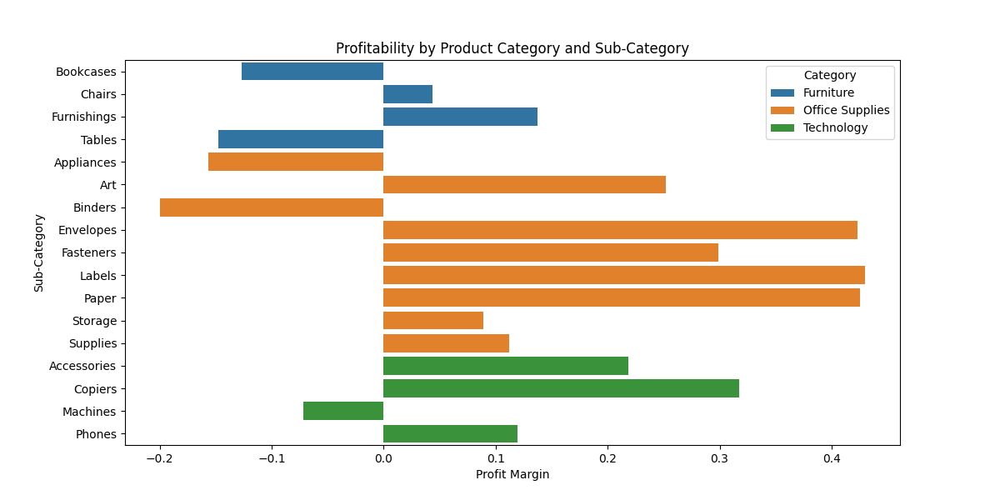
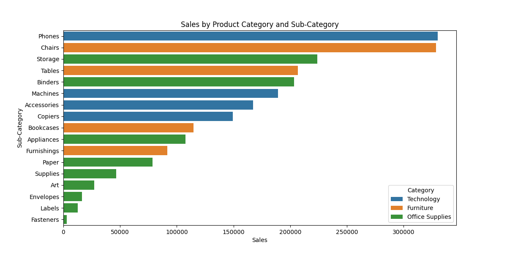
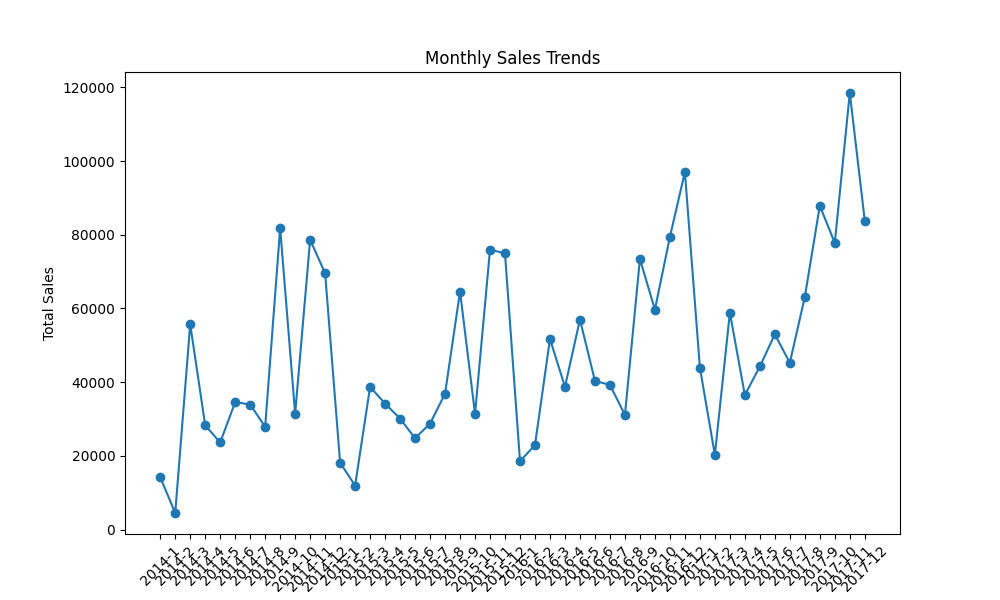

# Store Sales and Profit Analysis

## Project Overview

This project analyzes the sales and profit performance of a retail store using Python. It involves the following tasks:

- Data cleaning and preparation
- Temporal sales trends analysis
- Product category and sub-category performance analysis
- Identification of opportunities for operational optimization and marketing strategies

The dataset used is from the **Sample - Superstore** and contains various columns like Order Date, Sales, Profit, Product Categories, and more.

## Key Features
1. **Data Preparation**: Converts `Order Date` to datetime format and handles missing values.
2. **Sales Analysis**:
   - Temporal sales trends: Analyze sales patterns by month and year.
   - Category performance: Identify top-performing categories and sub-categories.

## Sales Trends Analysis


## Category Performance Analysis


## Profit Analysis


## Technologies Used
- **Python** (Pandas for data analysis)
- **Matplotlib** & **Seaborn** for visualizations
- **Jupyter Notebooks** for exploration

## How to Run the Code
1. Clone this repository:
   ```bash
   git clone https://github.com/aditichoudhury/shadowfox_store_sales_profit_analysis.git
